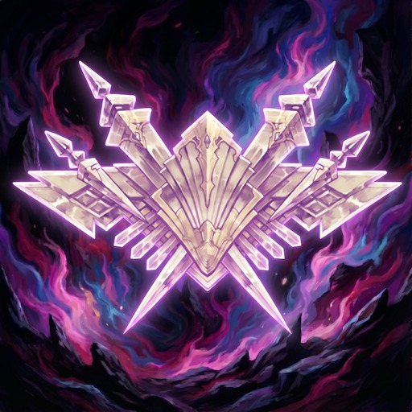

<p align="center">
  
</p>

<h1 align="center">Auto PVP Series Grind</h1>

<p align="center">
  <a href="https://github.com/XeldarAlz/FFXIV-AutoPVPSeriesGrind/releases/latest"></a>
  <a href="https://github.com/XeldarAlz/FFXIV-AutoPVPSeriesGrind/releases"></a>
  <a href="https://github.com/XeldarAlz/FFXIV-AutoPVPSeriesGrind/actions/workflows/release.yml"></a>
  <a href="LICENSE.md"></a>
</p>

<p align="center">
  <em>Casual Match PvP, on autopilot. Built on Dalamud.</em>
</p>

---

## What it does

Grinds the **PvP Series Malmstones** by looping Casual Match. Press **Start** and the plugin queues the Crystalline Conflict casual roulette, rides out each match (RotationSolver fights, vnavmesh moves you onto the objective crystal), fires your job's PvP Limit Break, sends a quick greeting, leaves on the results screen, and requeues — until it hits your match limit.

## Features

- **Hands-off match loop**: queue → fight on the crystal → Limit Break → leave → requeue.
- **Match limit**: stop after N completed matches, or run until you stop it.
- **Spawn-aware movement**: leaves the spawn pen toward the right side and contests the objective, holding the point when it's contested instead of re-pathing.
- **Auto Limit Break**: fires the correct PvP LB for your job on a throttle.
- **Social touches**: optional `Hello` during portraits and `Good Match` on results.
- **Run history**: matches, deaths, and time tracked per session.
- **Resilient**: cancellable mid-run, settings persist across reloads.

## Install

In-game: `/xlsettings` → **Experimental** → paste into **Custom Plugin Repositories**:

```
https://raw.githubusercontent.com/XeldarAlz/DalamudPlugins/main/repo.json
```

Tick **Enabled**, click **+**, then **Save and Close**. Open `/xlplugins` → **All Plugins**, search for **Auto PVP Series Grind**, and install.

The plugin drives a few helpers for movement and combat. Open `/apsg deps` after install to see the list and one-click each missing one:

- **vnavmesh** — pathfinding/movement (required)
- **RotationSolver Reborn** — combat (required)
- **Lifestream** — optional, only for the "Return to the inn" after-run action

The match loop also fires `/pvpac` (Limit Breaks, sprint) and `/quickchat` commands when available, exactly as the original SND script does — these are best-effort and not gated as dependencies.

## Commands

| Command | Action |
|---|---|
| `/apsg` | Toggle the main window |
| `/pvpseries` | Alias for `/apsg` |
| `/apsg config` | Open settings |
| `/apsg deps` | Open dependencies window |
| `/apsg about` | Open credits / links |
| `/apsg stats` | Open run history |
| `/apsg target` | Log targeted object's BaseId (debug helper) |

## More from me

If you liked this plugin, take a look at my other Dalamud work. You might find something else there for you.

→ [XeldarAlz Dalamud Plugins](https://github.com/XeldarAlz/DalamudPlugins)

## License

AGPL-3.0-or-later. See [LICENSE.md](LICENSE.md).
