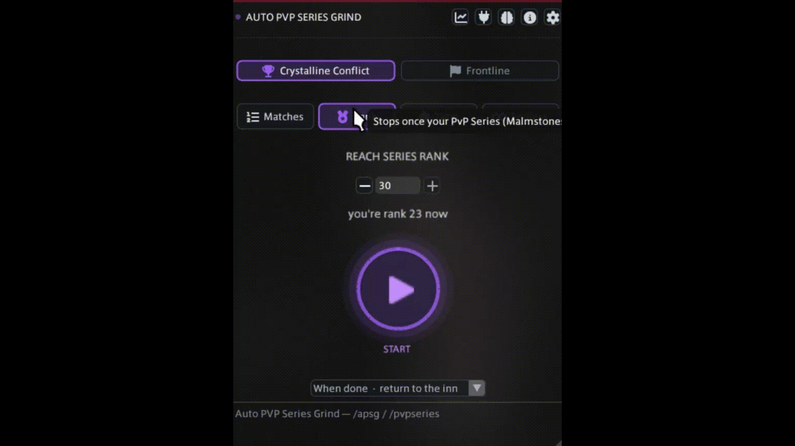

<p align="center">
  
</p>

<h1 align="center">Auto PVP Series Grind</h1>

<p align="center">
  <a href="https://github.com/XeldarAlz/FFXIV-AutoPVPSeriesGrind/releases/latest"></a>
  <a href="https://github.com/XeldarAlz/FFXIV-AutoPVPSeriesGrind/releases"></a>
  <a href="https://github.com/XeldarAlz/FFXIV-AutoPVPSeriesGrind/actions/workflows/release.yml"></a>
  <a href="LICENSE.md"></a>
</p>

<p align="center">
  <em>PvP Series, grinded for you. Built on Dalamud.</em>
</p>

---

<p align="center">
  
</p>

## What it does

Grinds the **PvP Series Malmstones** by looping Crystalline Conflict Casual Match or the daily Frontline roulette. Press **Start** and the plugin queues, rides out each match, runs your job's PvP rotation, fires the Limit Break, sends a quick greeting, leaves on the results screen, and requeues until it reaches the goal you set: a match count, a Series rank, a time box, or endless.

## Features

- **Hands-off match loop**: queue → fight → leave → requeue, in Crystalline Conflict or Frontline.
- **Frontline mode**: queues the daily Frontline roulette on every arena and sticks with the team, holding a role-appropriate spot in the group, falling back when hurt and mounting up to rejoin after a respawn.
- **Built-in PvP rotation**: presses your job's PvP skills, Guard, Purify, Recuperate and Elixir itself; the defensive thresholds are adjustable under Settings, Combat. Switch it to Manual there if you would rather press your own skills.
- **Goals**: run N matches, reach a Series rank, run for a set time, or go endless until you press Stop.
- **Two ways to stop**: **Stop** ends the run at once; **Finish, then stop** lets the match in progress play out first, so nobody gets abandoned.
- **Spawn-aware movement**: leaves the spawn pen toward the right side and contests the objective, holding the point when it's contested instead of re-pathing.
- **Auto Limit Break**: fires the correct PvP LB for your job through Auto PVP LB, with per-job presets pushed to it automatically.
- **Social touches**: optional `Hello` during portraits and `Good Match` on results.
- **Run history**: matches, deaths, and time tracked per session.
- **After the run**: stay where you are, return to the inn via Lifestream, log out, or close the game.
- **Resilient**: cancellable mid-run, settings persist across reloads.

## Install

In-game: `/xlsettings` → **Experimental** → paste into **Custom Plugin Repositories**:

```
https://raw.githubusercontent.com/XeldarAlz/DalamudPlugins/main/repo.json
```

Tick **Enabled**, click **+**, then **Save and Close**. Open `/xlplugins` → **All Plugins**, search for **Auto PVP Series Grind**, and install.

Two helper plugins are required: [vnavmesh](https://github.com/awgil/ffxiv_navmesh) for movement and [Auto PVP LB](https://github.com/XeldarAlz/FFXIV-AutoPVPLimitBreak) for the Limit Break. [Lifestream](https://github.com/NightmareXIV/Lifestream) is optional and only used by the return-to-the-inn after-run action. Combat needs nothing extra. Open `/apsg deps` after install to see the list and one-click each missing one.

## Commands

| Command | Action |
|---|---|
| `/apsg` | Toggle the main window |
| `/pvpseries` | Alias for `/apsg` |
| `/apsg config` | Open settings |
| `/apsg deps` | Open dependencies window (alias: `dependencies`) |
| `/apsg about` | Open credits / links |
| `/apsg stats` | Open run history (alias: `history`) |
| `/apsg target` | Log targeted object's BaseId (debug helper) |
| `/apsg objects` | Log the objective object IDs on the current map (debug helper) |

## Languages

The windows are available in English, Deutsch, Français, Español, Português (Brasil), Русский, Türkçe, 日本語, and 中文. The plugin picks a language from your Dalamud and game client settings on first launch; change it any time under Settings, Session, Language. Game data such as job and map names always follows the game client.

Spotted a wrong or awkward translation? Open a [translation issue](https://github.com/XeldarAlz/FFXIV-AutoPVPSeriesGrind/issues/new?template=translation_report.yml) and tell me what it should say instead.

## More from me

If you liked this plugin, take a look at my other Dalamud work. You might find something else there for you.

→ [XeldarAlz Dalamud Plugins](https://github.com/XeldarAlz/DalamudPlugins)

## License

AGPL-3.0-or-later. See [LICENSE.md](LICENSE.md). [NOTICE](NOTICE) adds the attribution terms the AGPL allows: a fork, or any project that reuses this code, must credit the original author and must not pass itself off as the original. The license covers the code, not the name or the icon: read the [trademark and naming policy](TRADEMARK.md) before you publish a fork.

How AI is used to build this plugin is written down in [AI usage](AI-USAGE.md).
